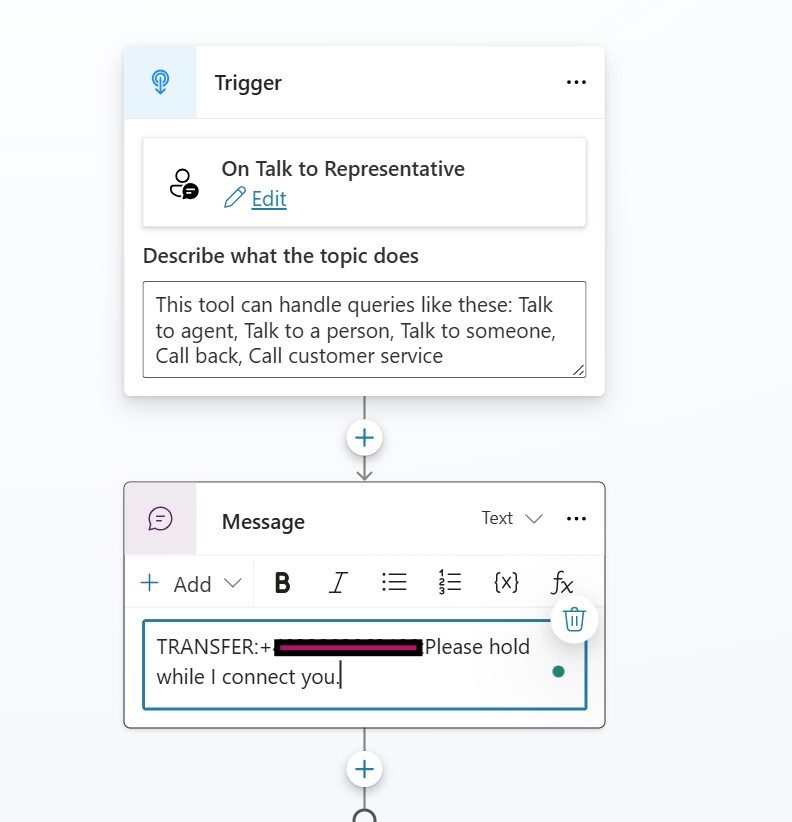

# telephony channel for Copilot Studio via Azure Communication Services

## Overview

This project showcases a telephony integration between **Azure Communication Services (ACS)** and **Microsoft Copilot Studio (MCS)** virtual agents. 
The application creates a voice-based customer service experience by:

1. Accepting incoming phone calls through ACS
2. Converting speech to text using real-time transcription
3. Sending the transcribed content to a Copilot Studio agent via the Direct Line API
4. Transforming the agent's responses into spoken audio using SSML (Speech Synthesis Markup Language)
5. Delivering the synthesized speech back to the caller

This solution provides an alternative communication channel for Copilot Studio agents.
enabling organizations to extend their conversational AI capabilities to traditional phone systems
while leveraging the natural language understanding and dialog management features of Microsoft Copilot Studio.

[Listen to the audio](./assets/call.m4a)

<audio controls>

<source src="https://github.com/holgerimbery/ACSFORMCS/raw/main//assets/call.mp4a" type="audio/mpeg">

Your browser does not support the audio element.

</audio>


## Documentation of the Code
[Documentation](./code_documentation.md) for those who are interested in.

## Discaimer
For an enterprise-grade implementation, we suggest using Dynamics 365 Customer Service or Dynamics 365 Contact Center (while working with a non-Microsoft CRM solution).


## Credits and Acknowledgments
This project is based on and inspired by architectural samples and technical guidance provided by Microsoft. We extend our gratitude to the Microsoft engineering teams for their comprehensive documentation and sample code that served as the foundation for this integration. The approach showcased here leverages best practices recommended by Microsoft for connecting Azure Communication Services with conversational AI platforms like Copilot Studio. Special thanks to the Azure Communication Services and Microsoft Copilot Studio product teams for their excellent technical resources that made this implementation possible.

The underlying concepts and design patterns follow established architectural principles for cloud-native telephony integrations with conversational AI systems. While we've built upon these foundations, we've tailored the solution to address specific requirements and use cases for voice-enabled customer service experiences.
[link to original codebase](https://github.com/Azure-Samples/communication-services-dotnet-quickstarts/tree/main/CallAutomation_MCS_Sample). (We are happy to sync back our changes)


## Required Resources

Before getting started, ensure you have the following components ready:

- **Azure Subscription**: You'll need an active Azure account. If you don't have one, you can [sign up for a free Azure account](https://azure.microsoft.com/free/), which includes credit for exploring services.

- **Azure Communication Services (ACS)**: Deploy an ACS resource from the Azure portal to enable telephony capabilities. Follow the [official guide to create your Communication Resource](https://docs.microsoft.com/azure/communication-services/quickstarts/create-communication-resource) and save the **connection string** for configuration. Ensure you use the system-assigned identity and configure the Cognitive Services resource. 

- **Phone Number**: Provision a telephone number in your ACS resource that will receive incoming calls. See the [documentation on acquiring phone numbers](https://learn.microsoft.com/en-us/azure/communication-services/quickstarts/telephony/get-phone-number?tabs=windows&pivots=platform-azp) for step-by-step instructions. 

- **Azure Cognitive Services** - Azure AI services multi-service account: Create a Cognitive Services resource to power the speech recognition and synthesis features. This enables the voice-to-text and text-to-voice conversion capabilities. [Follow these steps to set up Cognitive Services](https://learn.microsoft.com/en-us/azure/cognitive-services/cognitive-services-apis-create-account). Ensure you use the system-assigned identity.

- **Microsoft Copilot Studio Agent**: Develop a conversational agent in Microsoft Copilot Studio that will handle the conversation logic.

- **Development Environment**: Install the [Azure Dev Tunnels CLI](https://learn.microsoft.com/en-us/azure/developer/dev-tunnels/get-started?tabs=windows) to create a secure tunnel that exposes your local development environment to the internet, allowing ACS to send event notifications to your application.

## Setup Instructions

This section outlines the detailed setup process to get your telephony integration working. Follow these steps to configure your development environment and the required Azure resources.

### Development Environment Setup

1. **Clone this repository**
    ```bash
    git clone https://github.com/your-username/ACSforMCS.git
    cd ACSforMCS
    ```

2. **Install .NET SDK**
    This project requires .NET 6.0 or later. [Download and install](https://dotnet.microsoft.com/download) the appropriate version for your operating system.

3. **Restore dependencies**
    ```bash
    dotnet restore
    ```
### hint: 
Constants.cs   
DirectLineHealthCheck.cs    
if you are not in region europe, please remove "europe." from the directline.botframework.com URI


### Azure DevTunnel Setup

[Azure DevTunnels](https://learn.microsoft.com/en-us/azure/developer/dev-tunnels/overview) creates a secure tunnel exposing your local web service to the internet, allowing Azure Communication Services to send call notifications to your application.

1. **Install Azure DevTunnels CLI**
    Follow the [installation instructions](https://learn.microsoft.com/en-us/azure/developer/dev-tunnels/get-started?tabs=windows) for your operating system.

2. **Create and host your tunnel**
    ```bash
    # Create a tunnel with anonymous access
    devtunnel login 
      
    # Start hosting the tunnel
    devtunnel host -p 5252 --allow-anonymous
    
    ```

3. **Note your tunnel URL**
    Save the generated URL (e.g., `https://example.devtunnels.ms`) for the next steps.

### Configuration Setup

1. **Create an Azure Keyvault and add your configuration to it**   
replace the string "your-resource-base-name" with your own values you used to setup your resources on Azure

```powershell
# Create a resource group if you don't have one already
$resourceGroup = "rg-your-resource-base-name-prod"
$location = "westeurope"

# Create a Key Vault
$keyVaultName = "kv-your-resource-base-name"
New-AzKeyVault -Name $keyVaultName -ResourceGroupName $resourceGroup -Location $location

# Add the required secrets
```powershell
# Set your actual service values
$secrets = @{
    "CognitiveServiceEndpoint" = "https://cog-your-resource-base-name.cognitiveservices.azure.com/"
    "AcsConnectionString" = "endpoint=https://acs-your-resource-base-name.communication.azure.com/;accesskey=youraccesskey"
    "DirectLineSecret" = "your-directline-secret"
    "AgentPhoneNumber" = "+1234567890"
    "BaseUri-Development" = "https://your-devtunnel-url"
    "BaseUri-Production" = "https://app-your-resource-base-name.azurewebsites.net"
}


foreach ($key in $secrets.Keys) {
    $secureValue = ConvertTo-SecureString $secrets[$key] -AsPlainText -Force
    Set-AzKeyVaultSecret -VaultName $keyVaultName -Name $key -SecretValue $secureValue
}
```

2. **Create appsettings.json files**
    - Create `appsettings.json` based on the sample file "appsettings.json.sample":
      ```bash
      cp appsettings.json.sample appsettings.json
      ```
    - Look at the file:
      ```json
        "KeyVault": {
            "Endpoint": ""
        },
      ```
    There is no need to expose your keyvault URI in the Code, just use the already existing lines in the "appsettings.json.sample" file. We store the URI as User Secret in .NET.

    ```powershell
    dotnet user-secrets init --project c:\<your-path>\GitHub\ACSforMCS\ACSforMCS.csproj

    dotnet user-secrets set "KeyVault:Endpoint" "https://{your uri}/" --project c:\<your-path>\ACSforMCS\ACSforMCS.csproj

    ```
    - Create a "appsettings.Production.json" based on the "appsettings.Production.json.sample" and find the keyvault endpoint configured as a Github Secret.
    - Go to your GitHub repository
    - Navigate to Settings > Secrets and variables > Actions
    - Create a new repository secret named "KEY_VAULT_ENDPOINT" with the value "https://{your-keyvault-uri}/"


### Copilot Studio Configuration

1. **Enable Direct Line channel**
    - Navigate to your Copilot Studio portal
    - Go to settings and select Security
    - Deactivate Authentication 
    - Copy a secret from the Web Channel Security tab.

2. **Design conversation flow**
    - Create appropriate topics in your agent to handle phone interactions
    - Consider adding specific greetings for voice channel users
    - Test your agent responses through the web interface before integrating with voice

## Running the Application

This section guides you through starting the application and testing your telephony integration between Azure Communication Services and Microsoft Copilot Studio.

### Starting the Service

1. **Verify Azure DevTunnel**
    - Ensure your DevTunnel is active and properly configured
    - Confirm the tunnel URL matches the `BaseUri` in your `appsettings.json`
    - The tunnel should be forwarding traffic to port 5252 (or your configured port)

2. **Launch the application**
    ```bash
    dotnet run --environment Development
    ```
    The application will start locally and be accessible through your DevTunnel URL.

3. **Configure Event Grid for Call Notifications**
    - In your Azure Communication Services resource, navigate to "Events"
    - Create a new Event Subscription
    - Select the "IncomingCall" event type
    - Configure the webhook endpoint with your DevTunnel URL and add "/api/incomingCall"
    - Follow the [detailed instructions in the Microsoft documentation](https://learn.microsoft.com/en-us/azure/communication-services/concepts/call-automation/incoming-call-notification)

### Testing Your Integration

1. **Place a test call**
    - Dial your provisioned ACS phone number from any phone
    - You should hear the welcome message from your Copilot Studio agent
    - Speak naturally to interact with your agent through voice

2. **Monitor application logs**
    - The console will display real-time logs of call activities
    - You'll see transcription results, agent interactions, and any errors

3. **Troubleshooting**
    - If the call doesn't connect, verify your Event Grid subscription is properly configured
    - Check that your Copilot Studio agent is responding correctly via the Direct Line channel
    - Ensure your Azure Communication Services number is properly provisioned

Your telephony integration is now operational, allowing callers to interact with your Copilot Studio agent through traditional phone calls. The system converts speech to text, processes it through your intelligent agent, and delivers synthesized speech responses back to the caller.

## Telephony features
### Call transfer
create a message node with 3 elements in the message
* TRANSFER
* Target phonenumber in E164
* message to the user

  
```
TRANSFER:+12345678:Message to User
```




## Cloud-Native Architecture (documentation: work in progress)

The solution leverages modern cloud-native principles to ensure scalability, resilience, and maintainability.

For production-ready deployment instructions, refer to [Azure Deployment Guide for ACSforMCS.md](Azure%20Deployment%20Guide%20for%20ACSforMCS.md).

## Planned Enhancements

**Telephony Enhancements**   
    - DTMF Recognition   
    - Call Forward to a Teams User   
      
## Want to Contribute?
Helping hands are welcome to enhance this telephony integration capability. If you're interested in contributing, please reach out to us with your ideas and PRs. 

